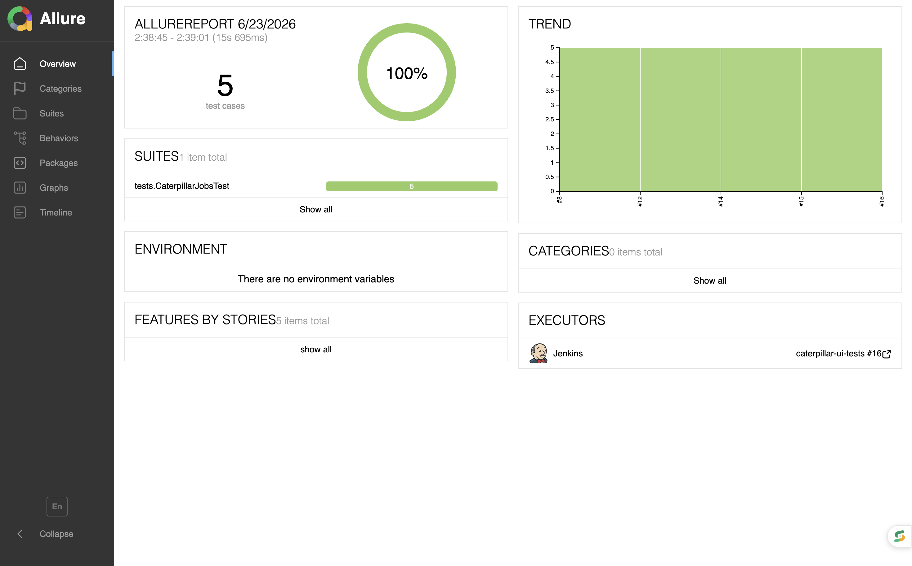
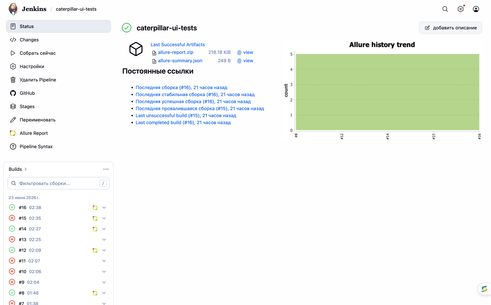
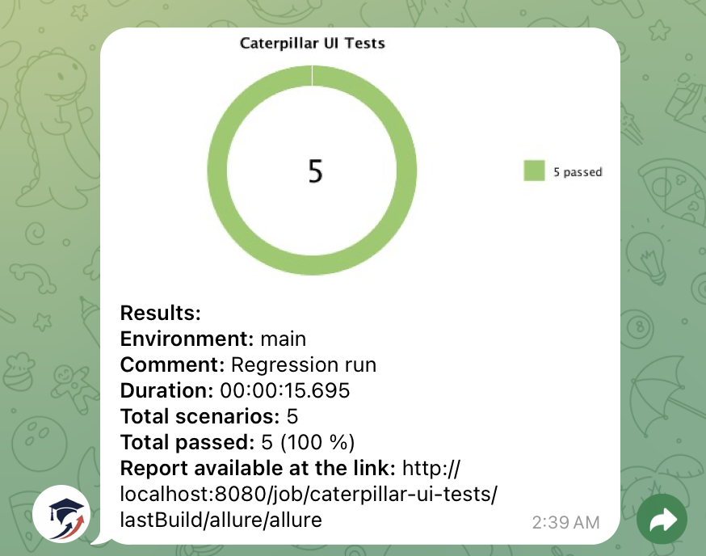
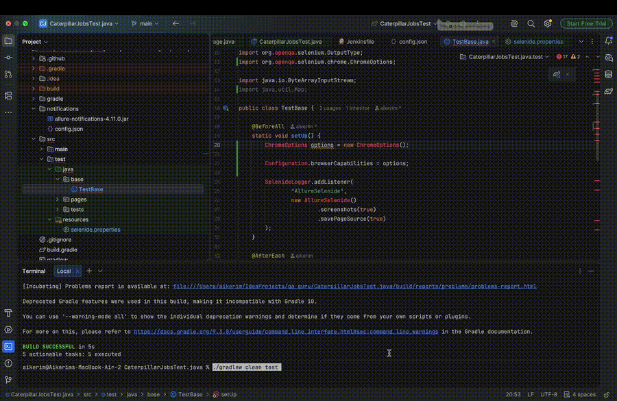

# Caterpillar Jobs UI Test Automation

<p align="center">
  
</p>

<p align="center">
  UI test automation project for the Caterpillar Careers website
</p>

<p align="center">
  <a href="https://careers.caterpillar.com/">
    <b>Caterpillar Careers</b>
  </a>
  •
  <a href="https://jenkins.qa.guru/job/41-Aikerim-caterpillar-ui-tests/">
    <b>Jenkins</b>
  </a>
  •
  <a href="https://aikerimmm.github.io/CaterpillarJobsTest.java/">
    <b>Allure Report</b>
  </a>
</p>

The project demonstrates automated testing of the Caterpillar Jobs page using **Java, Selenide, JUnit 5, Gradle, Allure Report, Jenkins, and Selenoid**.

---

## 📋 Contents

- [Description](#-description)
- [Technologies and Tools](#-technologies-and-tools)
- [Implemented Tests](#-implemented-tests)
- [Project Structure](#-project-structure)
- [Test Architecture](#-test-architecture)
- [Running Tests](#️-running-tests)
- [Selenoid](#-selenoid)
- [Allure Report](#-allure-report)
- [Jenkins CI](#-jenkins-ci)
- [Telegram Notifications](#-telegram-notifications)
- [Test Execution Video](#-test-execution-video)
- [Allure Attachments](#-allure-attachments)
- [Configuration](#️-configuration)
- [Key Features](#-key-features)
- [Author](#-author)

---

## 📖 Description

This project contains automated UI tests for the **Caterpillar Careers Jobs** page.

The main goal of the project is to demonstrate a maintainable UI automation framework with:

- Page Object Model
- reusable `TestBase`
- Selenide smart waits
- Allure `@Step` annotations
- automatic screenshots and page source attachments
- remote browser execution with Selenoid
- CI execution with Jenkins
- Allure reporting
- Telegram test notifications

### Tested Page

[Caterpillar Careers — Jobs](https://careers.caterpillar.com/en/jobs/)

---

## 🛠 Technologies and Tools

<p align="center">
  
  &nbsp;&nbsp;
  
  &nbsp;&nbsp;
  
  &nbsp;&nbsp;
  
  &nbsp;&nbsp;
  
  &nbsp;&nbsp;
  
  &nbsp;&nbsp;
  
</p>

<p align="center">
  <b>Selenide</b> •
  <b>Selenium WebDriver</b> •
  <b>JUnit 5</b> •
  <b>Allure Report</b> •
  <b>Selenoid</b> •
  <b>Telegram</b>
</p>

| Technology | Purpose |
|---|---|
| Java | Programming language |
| Selenide | UI test automation |
| Selenium WebDriver | Browser automation |
| JUnit 5 | Test framework |
| Gradle | Build and dependency management |
| Allure Report | Test reporting |
| Allure Selenide | Selenide steps and attachments |
| Selenoid | Remote browser execution |
| Docker | Running Selenoid infrastructure |
| Jenkins | Continuous Integration |
| Git | Version control |
| GitHub | Source code repository |

---

## 🧪 Implemented Tests

The project contains automated tests for the Caterpillar Jobs page.

### Page opens and displays jobs

Verifies that the jobs page is successfully opened and job results are available.

### Search returns results

Performs a job search using the keyword:

```text
Engineer
```

and verifies that search results are displayed.

### Job cards are displayed

Verifies that the expected number of job cards is loaded on the page.

### First job title is displayed

Verifies that the first job card contains a non-empty job title.

### Job count is greater than minimum value

Verifies that the number of available jobs is greater than the specified minimum value.

The assertions for web elements are implemented using **Selenide conditions** such as:

```java
element.shouldBe(visible);

element.shouldHave(text("Expected text"));

collection.shouldHave(
        CollectionCondition.sizeGreaterThan(minSize)
);
```

Selenide conditions provide built-in smart waiting and help reduce flaky UI tests.

---

## 📁 Project Structure

```text
CaterpillarJobsTest.java
├── .github
│   └── images
│       ├── allure.png
│       ├── jenkins.png
│       ├── telegram.png
│       └── video
│           └── test-execution.gif
│
├── gradle
│
├── media
│   ├── caterpillar-logo.png
│   ├── test-execution.mov
│   └── test-execution.mp4
│
├── notifications
│   ├── allure-notifications-4.11.0.jar
│   └── config.json
│
├── src
│   ├── main
│   │
│   └── test
│       ├── java
│       │   ├── base
│       │   │   └── TestBase.java
│       │   │
│       │   ├── pages
│       │   │   └── CaterpillarJobsPage.java
│       │   │
│       │   └── tests
│       │       └── CaterpillarJobsTest.java
│       │
│       └── resources
│           └── selenide.properties
│
├── .gitignore
├── build.gradle
├── gradlew
├── gradlew.bat
├── Jenkinsfile
├── README.md
└── settings.gradle
```

---

## 🏗 Test Architecture

The project follows the **Page Object Model** approach.

### TestBase

`TestBase` contains common test configuration and lifecycle logic.

It is responsible for:

- browser configuration
- Selenide configuration
- Allure Selenide listener registration
- screenshot attachments
- page source attachments
- browser cleanup after test execution

This keeps configuration and common test logic outside individual test classes.

### Page Object

`CaterpillarJobsPage` contains:

- page elements
- user actions
- page-level verification methods

Page methods use Allure `@Step` annotations to make test execution easier to understand in reports.

Example:

```java
@Step("Verify that job cards count is greater than {minSize}")
public CaterpillarJobsPage verifyCardsCountIsGreaterThan(int minSize) {
    jobCards.shouldHave(
            CollectionCondition.sizeGreaterThan(minSize)
    );
    return this;
}
```

### Tests

`CaterpillarJobsTest` contains test scenarios only.

Example:

```java
@Test
void jobCountIsPositiveNumber() {
    jobsPage
            .open()
            .verifyCardsCountIsGreaterThan(10);
}
```

This approach keeps the test code readable and separates test scenarios from implementation details.

---

## ▶️ Running Tests

### Prerequisites

Make sure the following tools are installed:

- Java
- Docker
- Git

Gradle Wrapper is already included in the project.

### Clone Repository

```bash
git clone https://github.com/aikerimmm/CaterpillarJobsTest.java.git
```

Open the project directory:

```bash
cd CaterpillarJobsTest.java
```

### Run All Tests

```bash
./gradlew clean test
```

### Run a Specific Test

```bash
./gradlew clean test --tests "tests.CaterpillarJobsTest.pageOpensAndShowsJobs"
```

---

## 🐳 Selenoid

The project supports remote browser execution using **Selenoid**.

Selenide remote configuration:

```properties
selenide.browser=chrome
selenide.remote=http://localhost:4444/wd/hub
selenide.headless=false
```

Selenoid runs browser sessions inside Docker containers, which makes the test environment isolated and reproducible.

Check that Selenoid is running:

```bash
docker ps
```

The Selenoid service should be available on port:

```text
4444
```

The test execution flow is:

```text
JUnit 5
   ↓
Selenide
   ↓
Remote WebDriver
   ↓
Selenoid
   ↓
Docker Container
   ↓
Chrome
```

---

## 📊 Allure Report

The project uses **Allure Report** for test execution reporting.

<p align="center">
  <a href="https://aikerimmm.github.io/CaterpillarJobsTest.java/">
    <b>Open Public Allure Report</b>
  </a>
</p>

The report includes:

- test execution status
- test steps
- execution duration
- screenshots
- page source
- failure details

### Allure Report Example

<p align="center">
  <a href="https://aikerimmm.github.io/CaterpillarJobsTest.java/">
    
  </a>
</p>

### Generate Allure Report

```bash
./gradlew allureReport
```

### Open Allure Report Locally

```bash
./gradlew allureServe
```

Screenshots and page source are attached to Allure to simplify failure investigation.

---

## 🔄 Jenkins CI

The project is integrated with **Jenkins CI** for automated test execution.

<p align="center">
  <a href="https://jenkins.qa.guru/job/41-Aikerim-caterpillar-ui-tests/">
    <b>Open Jenkins Job</b>
  </a>
</p>

The Jenkins CI process:

- checks out the project from GitHub
- runs automated UI tests
- executes browser tests using remote infrastructure
- generates Allure results
- publishes the Allure report
- sends test execution notifications

### Jenkins CI Flow

```text
GitHub
   ↓
Jenkins
   ↓
Gradle
   ↓
JUnit 5
   ↓
Selenide
   ↓
Selenoid
   ↓
UI Tests
   ↓
Allure Report
   ↓
Telegram Notification
```

### Jenkins Pipeline

<p align="center">
  <a href="https://jenkins.qa.guru/job/41-Aikerim-caterpillar-ui-tests/">
    
  </a>
</p>

<p align="center">
  <a href="https://jenkins.qa.guru/job/41-Aikerim-caterpillar-ui-tests/">
    <b>Open Jenkins Job</b>
  </a>
</p>

This allows automated tests to be executed consistently through CI instead of depending only on a local development environment.

---

## 📩 Telegram Notifications

The project supports Telegram notifications for test execution results.

Notification configuration is stored in:

```text
notifications/
├── allure-notifications-4.11.0.jar
└── config.json
```

After test execution, the notification contains information about the test run and its result.

The notification can include:

- total number of tests
- passed tests
- failed tests
- skipped tests
- test execution statistics
- Allure report information

### Telegram Notification Example

<p align="center">
  
</p>

Sensitive credentials and tokens should not be stored directly in the public repository.

---

## 🎥 Test Execution Video

A recorded example of automated UI test execution.

<p align="center">
  
</p>

The animation demonstrates the automated tests interacting with the Caterpillar Careers website.

[▶️ Open full test execution video](media/test-execution.mp4)

---

## 📎 Allure Attachments

For easier debugging, test execution information is automatically attached to the Allure report.

Available attachments include:

- browser screenshots
- page source
- Selenide execution steps
- failure information

Example screenshot attachment logic is located in:

```text
src/test/java/base/TestBase.java
```

These attachments make it easier to investigate failed UI tests without rerunning them locally.

---

## ⚙️ Configuration

Selenide configuration is located in:

```text
src/test/resources/selenide.properties
```

Example:

```properties
selenide.browser=chrome
selenide.remote=http://localhost:4444/wd/hub
selenide.headless=false
```

The configuration can be adjusted depending on whether tests are executed locally or through Selenoid.

---

## 🔍 Key Features

- Page Object Model
- reusable `TestBase`
- Selenide smart waits
- Selenide conditions for web element assertions
- Allure `@Step` annotations
- screenshots on test failures
- page source attachments
- remote browser execution
- Docker/Selenoid integration
- Jenkins CI
- public Jenkins job
- public Allure Report
- Telegram notifications
- recorded test execution example

---

## 👩‍💻 Author

**Aikerim**

QA Automation Engineer